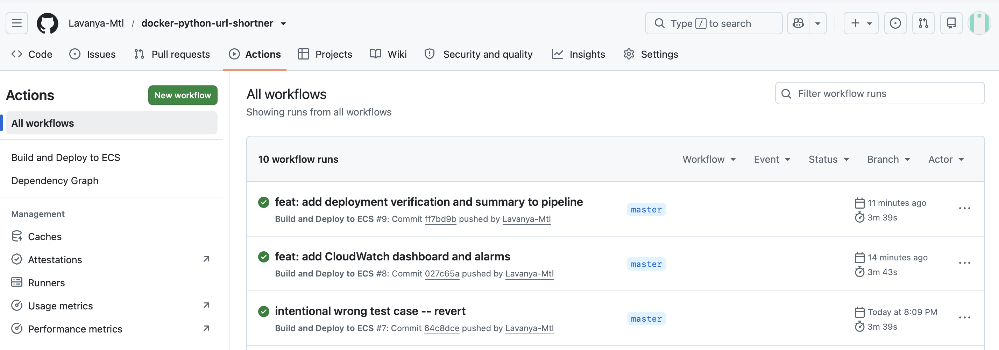
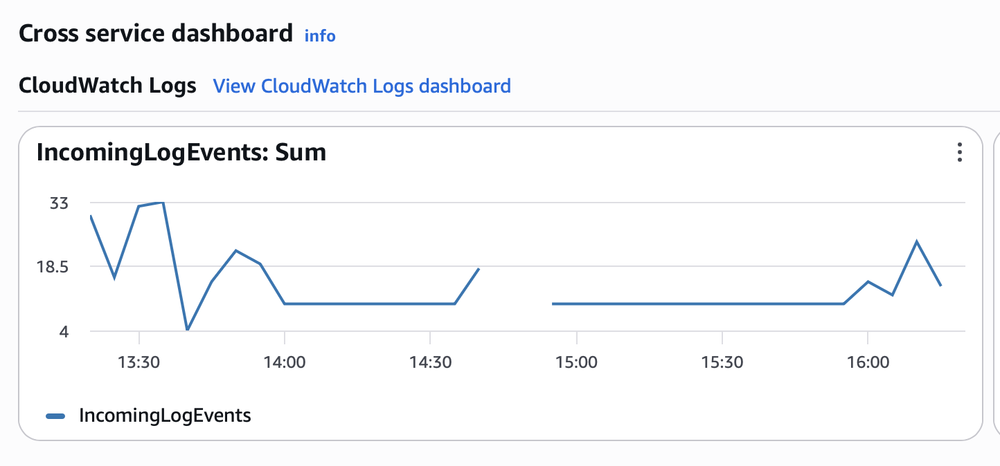

# URL Shortener — DevOps Portfolio Project

A production-style DevOps pipeline built to demonstrate end-to-end infrastructure automation, containerisation, and CI/CD on AWS.

> **Stack:** FastAPI · Docker · AWS ECR · AWS ECS Fargate · Terraform · GitHub Actions · CloudWatch

---

## Architecture

```
Developer pushes code
        │
        ▼
┌─────────────────┐
│  GitHub Actions │  ← runs tests, builds image
└────────┬────────┘
         │
         ▼
┌─────────────────┐
│    AWS ECR      │  ← stores Docker image
└────────┬────────┘
         │
         ▼
┌─────────────────┐
│  ECS Fargate    │  ← runs the container (serverless)
└────────┬────────┘
         │
         ▼
┌─────────────────┐
│  CloudWatch     │  ← logs, metrics, alarms
└─────────────────┘

All infrastructure provisioned with Terraform.
```
---

## Architecture Diagram

See [docs/architecture.mmd](docs/architecture.mmd) — renders as a diagram on GitHub.

---

## What this project demonstrates

- **Containerisation** — Dockerised Python app with multi-stage best practices (non-root user, layer caching, `.dockerignore`)
- **Private image registry** — Docker image stored and versioned in AWS ECR
- **Infrastructure as Code** — All AWS resources (VPC, ECS cluster, Fargate service, IAM roles) defined in Terraform
- **CI/CD pipeline** — GitHub Actions workflow that tests, builds, and deploys on every push to `main`
- **Observability** — CloudWatch dashboard with CPU, memory, and HTTP error metrics

---

## The application

A URL shortener REST API built with FastAPI.

| Method | Endpoint | Description |
|--------|----------|-------------|
| GET | `/health` | Health check — used by ECS for container health |
| POST | `/shorten` | Accept a long URL, return a 6-char short code |
| GET | `/resolve/{code}` | Resolve a short code back to the original URL |
| GET | `/docs` | Auto-generated Swagger UI |

---

## Project structure

```
DevOpsPortfolio/
├── app/
│   ├── main.py               # FastAPI application
│   ├── requirements.txt      # Python dependencies
│   └── tests/
│       └── test_main.py      # pytest test suite
├── infra/                    # Terraform (Week 2-3)
│   ├── main.tf
│   ├── variables.tf
│   ├── outputs.tf
│   └── ecs.tf
├── .github/
│   └── workflows/
│       └── deploy.yml        # GitHub Actions CI/CD pipeline
├── Dockerfile
├── .dockerignore
├── conftest.py
└── README.md
```

---

## Local setup

**Prerequisites:** Python 3.10+, Docker

```bash
# Clone the repo
git clone https://github.com/YOUR_USERNAME/DevOpsPortfolio.git
cd DevOpsPortfolio

# Create virtual environment
python -m venv .venv
source .venv/bin/activate

# Install dependencies
pip install -r app/requirements.txt

# Run tests
pytest app/tests/ -v

# Run locally
uvicorn app.main:app --reload
# Visit http://localhost:8000/docs
```

**Run with Docker:**

```bash
docker build -t url-shortener .
docker run -p 8000:8000 url-shortener
```

---

## AWS infrastructure setup

**Prerequisites:** AWS CLI configured, Terraform installed

```bash
cd infra

# Initialise Terraform
terraform init

# Preview what will be created
terraform plan

# Create all infrastructure
terraform apply

# Destroy when not in use (avoids charges)
terraform destroy
```

---

## CI/CD pipeline

Every push to `main` triggers the GitHub Actions workflow which:

1. Runs the pytest test suite — pipeline fails if any test fails
2. Builds the Docker image for `linux/amd64`
3. Pushes the image to AWS ECR with the commit SHA as the tag
4. Updates the ECS Fargate service to pull and run the new image
5. Waits for the deployment to stabilise before marking success

---

## Infrastructure decisions

| Decision | Choice | Reason |
|----------|--------|--------|
| Container orchestration | ECS Fargate | Serverless — no EC2 instances to manage |
| Image registry | AWS ECR | Native IAM auth, no credential management |
| IaC tool | Terraform | Industry standard, cloud-agnostic |
| CI/CD | GitHub Actions | Free for public repos, tight GitHub integration |
| Region | ap-south-1 (Mumbai) | Lowest latency from India |

---

## Monitoring

CloudWatch dashboard tracks:
- ECS CPU and memory utilisation
- HTTP 4xx and 5xx error rates
- Container health check status

---

## Screenshots

### CI/CD Pipeline


### CloudWatch Dashboard


---

## Author

**Lavanya** · M.Tech CSE · IGDTUW  
Previously: Software Engineer Intern at Juniper Networks (Terraform, Docker, Kubernetes, Kafka)  

